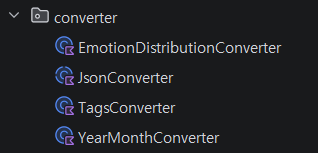

## @JdbcTypeCode(SqlTypes.JSON) vs @Convert

1. @JdbcTypeCode(SqlTypes.JSON)

- 데이터를 "객체"가 아닌 JSON으로 인식. Hibernate 6.0 이상부터 지원한다.
- 장점:
    - 간결한 코드: Converter 클래스 안 만들어도 됨
    - 타입 안전성: Jackson 라이브러리와 연동되어 객체, 리스트를 알아서 직렬화/역직렬화
    - DB 최적화: JSON 내부의 특정 키 값으로 검색할 때 유리함
        ```sql
        -- 'spring' 태그가 포함된 레코드 검색
        SELECT * FROM your_table 
        WHERE tag @> '["spring"]';
        ```
- 단점: 
    - DB 의존성: DB가 JSON 타입을 지원하지 않으면 작동 안함

2. @Convert

- 필드를 DB의 문자열(Varchar/Text)로 저장하기 위해 중간에서 수동으로 변환해주는 방식

- 장점:
    - 범용성: DB 종류, 버전 상관없음
    - 커스텀 로직: 변환 과정에서 로직이 필요하면 조정 가능

- 단점:
    - 번거로움: 타입마다 AttributeConverter를 상속받는 클래스를 만들어야 해서 보일러플레이트 코드가 늘어남
    - DB 검색 제약: JSON 내부 값을 이용한 효율적인 쿼리가 어려움

### @Converter의 문제점



```kotlin
abstract class JsonConverter<T>(
    private val typeReference: TypeReference<T>,
    private val objectMapper: ObjectMapper
) : AttributeConverter<T, String> {

    override fun convertToDatabaseColumn(attribute: T?): String? {
        return attribute?.let {
            try {
                objectMapper.writeValueAsString(it)
            } catch (e: Exception) {
                throw BusinessException(
                    GlobalErrorCode.JSON_CONVERSION_ERROR,
                    "객체를 JSON 문자열로 변환하는데 실패했습니다: ${typeReference.type.typeName}",
                    cause = e
                )
            }
        }
    }

    override fun convertToEntityAttribute(dbData: String?): T? {
        if (dbData.isNullOrBlank()) return null

        return try {
            objectMapper.readValue(dbData, typeReference)
        } catch (e: Exception) {
            throw BusinessException(
                GlobalErrorCode.JSON_CONVERSION_ERROR,
                "JSON을 객체로 변환하는데 실패했습니다: ${typeReference.type.typeName}",
                cause = e
            )
        }
    }
}
```

- JsonConverter는 추상 클래스로 Json으로 변환하는 게 아닌 YearMonthConverter를 제외한 다른 converter들은 이 클래스를 상속받는다.

- 현재는 2개의 컬럼만 JSON 타입이기에 2개만 정의를 해 주었으나, 만약 JSON 타입의 다른 컬럼이 추가될 경우 또 다시 converter를 정의해주어야 한다는 번거로움이 존재한다.

- 그래서 `@JdbcTypeCode(SqlTypes.JSON)` 어노테이션을 사용하여 간단하게 JSON 타입을 사용하기로 했다.

```kotlin
// Jpa Entity

@Entity
@Table(name = "diaries")
class DiaryJpaEntity(
    
    ...

    // jsonb 타입 지정
    @JdbcTypeCode(SqlTypes.JSON)
    @Column(name = "tags", columnDefinition = "jsonb")
    val tags: List<String>? = null,

    ...
)
```

```kotlin
// query 문
// JPQL에는 JSONB 검색 연산자가 없음
// 따라서 postgresql native 쿼리를 사용하여 tags 내에서 tag 값이 있는 데이터만 필터링한다. 

@Query(value = """
    SELECT d.id FROM diaries d
    WHERE d.created_at >= :start AND d.created_at < :end
    AND (:imageType IS NULL OR d.source_type = :imageType)
    AND (:hasPhoto = false OR EXISTS (
        SELECT 1 FROM diary_images
        WHERE diary_id = d.id
        AND image_url IS NOT NULL
    ))
    -- tag 필터링 --
    AND (:tag IS NULL OR d.tags ? :tag)
    ORDER BY d.created_at DESC
""", nativeQuery = true)
fun findIdsByFilters(
    @Param("start") start: LocalDateTime,
    @Param("end") end: LocalDateTime,
    @Param("imageType") imageType: String?,
    @Param("hasPhoto") hasPhoto: Boolean,
    @Param("tag") tag: String?,
    pageable: Pageable
): List<UUID>

// 지연 로딩으로 인한 N+1 쿼리 문제
// id를 먼저 가져온 뒤 join을 사용하는 것으로 해결 
@Query("""
    SELECT DISTINCT d FROM DiaryJpaEntity d
    LEFT JOIN FETCH d.diaryImages
    WHERE d.id IN :ids
    ORDER BY d.baseTime.createdAt DESC
""")
fun findAllByIdInWithImages(@Param("ids") ids: List<UUID>): List<DiaryJpaEntity>
```

### 정리

`@JdbcTypeCode` 는 Spring Data JPA(Hibernate 6 이상)에서 엔티티의 필드를 데이터베이스의 특정 SQL 타입으로 매핑할 때 사용하는 어노테이션으로, Json 매핑에 자주 사용된다.

다만 데이터베이스마다 JSON을 처리하는 방식이나 지원 여부가 다를 수 있으므로 데이터베이스 버전 및 환경을 잘 확인하고 사용해야 한다.

또한 타입만 지정할 뿐이기에 구체적으로 어떻게 변환할지 세세하게 지정하기 어렵다. 예를 들어 날짜 형식을 특정 패턴(ISO-8601)으로 강제하거나, 특정 필드를 암호화 해서 넣어야 할 때 한계가 발생한다. 이럴때는 `AttributeConverter`를 직접 구현하는 것이 추천된다.

필드 이름이 변경되면 이전에 저장된 데이터 내용을 읽어올 때 역직력화 문제가 발생할 수 있다. 해당 문제의 위험을 줄이기 위해 [flyway](20260319-flyway.md) 등의 마이그레이션 툴을 사용하기도 한다.