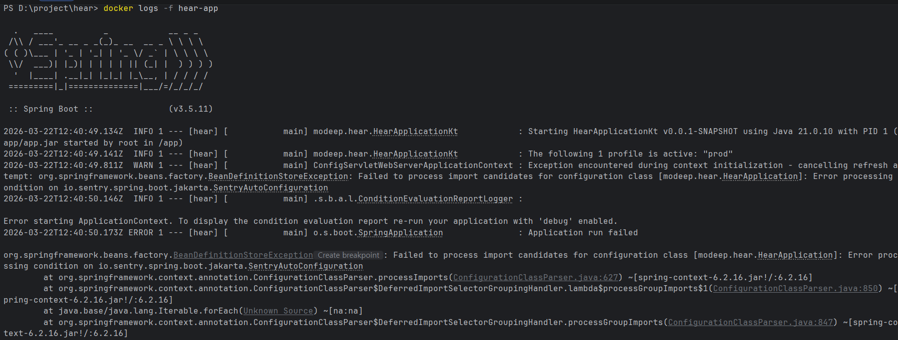

# Docker 기초 가이드

## 도커 기초 개념
### 1. 도커 기초 개념 3가지

Dockerfile: 재료 가이드
- 컨테이너를 만들기 위한 레시피 
- 어떤 운영체제를 쓸지, 어떤 프로그램을 설치할지 텍스트로 적어둔 문서

Image: 레시피
- Dockerfile를 바탕으로 만든 실행 가능한 패키지
- Read-only 상태이며, 언제든 똑같은 환경을 재생성할 수 있다.

Container: 조리된 음식
- 이미지라는 설계도를 바탕으로 실제로 실행된 상태
- 하나의 이미지로 여러 개의 독립된 컨테이너를 띄울 수 있다.

### 2. 도커 장점

- 환경 일관성: 개발자의 노트북, 테스트 서버, 실제 운영 서버 어디서든 똑같이 작동한다.

- 격리성: 여러 앱을 한 서버에 띄워도 서로 간섭하지 않는다.

- 빠른 배포: 가상머신(VM)보다 훨씬 가볍고 시작 속도가 매우 빠르다.

### 3. 기초 명령어

| 명령어 | 설명 |
| --- | --- |
`docker build -t [이름] .` | 현재 디렉토리의 Dockerfile로 이미지를 생성합니다.
`docker run -d -p 80:80 [이름]` | 컨테이너를 백그라운드에서 실행하고 포트를 연결합니다.
`docker ps` | 현재 실행 중인 컨테이너 목록을 확인합니다.
`docker stop [ID]` | 실행 중인 컨테이너를 정지시킵니다.
`docker images` | 내 컴퓨터에 저장된 이미지 목록을 확인합니다.
`docker pull [이미지명]` | 도커 허브(Docker Hub)에서 이미지를 다운로드합니다.

## 도커 실습해보기

1. 도커 허브에서 Repository를 하나 만든 뒤, 터미널에서 `docker login`을 입력하여 로그인한다.

2. 터미널에서 `docker images` 명령어로 내 이미지를 확인한다.

3. 이미지 태그 설정하기
    - `docker tag [my-app] [사용자명]/[레포이름]:[tag]`
    - `docker tag hear-app kusuri12/hear-spring-application:1.0`

4. 레포에 푸시하기
    - `docker push kusuri12/hear-spring-application:1.0`

5. compose.yml 파일 작성한 뒤 `docker-compose up -d` 명령어로 컨테이너 띄우기
    - `-d`: 백그라운드에서 실행, 안 붙이면 모든 로그가 보임
        - 붙인 뒤에도 로그가 보고 싶을 경우 `docker-compose logs -f`, ctrl + c로 빠져나올 수 있음
    - `--build`: 소스 코드가 변경되었을 때 다시 빌드
    - `docker-compose config`: 수정사항 미리보기
    - `docker-compose down`: 컨테이너 정지 및 삭제
        - `-v`: 볼륨까지 삭제

6. `docker logs -f [이름]`으로 컨테이너가 잘 띄워졌는 지 확인하기
    - `docker logs -f hear-app`
    

    - 뻗어있는 스프링 애플리케이션을 확인해 볼 수 있었다.

    