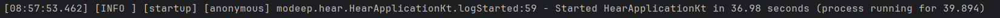
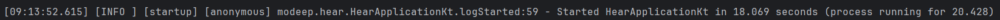
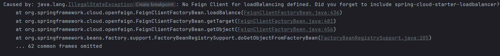
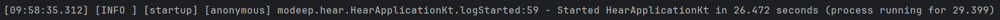
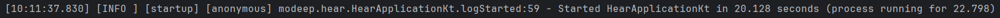
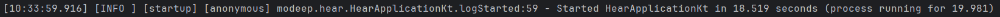

# 스프링 빌드 시간 단축해보기



개발 중, 스프링 부트 애플리케이션의 실행 시간이 36초나 걸리는 걸 발견했다. docker-compose와 다른 외부 연동들 때문에 시간이 오래 걸리는 것으로 보였다. 아래는 해당 시간을 단축시켜보고자 해본 노력들이다.

### application.yml 설정 추가

```yml
spring:
  docker:
    compose:
      enabled: true
      file: compose.yaml
      lifecycle-management: start_only # 매번 stop/start 하지 않고 실행만 유지
      readiness:
        wait: never # 컨테이너가 완전히 Healthy 상태가 될 때까지 기다리지 않음
```
애플리케이션을 종료해도 컨테이너가 함께 종료하지 않도록 설정했다.
추가로 빠른 실행이 목적임으로 컨테이너의 healthy 상태를 기다리지 않도록 설정했다.

```yml
spring:
  datasource:
    hikari:
      initialization-fail-timeout: 0
      connection-timeout: 20000
```
히카리 풀에 DB가 없어도 앱은 일단 띄우도록 설정했다.



15초 정도 단축된 걸 확인할 수 있었다.

좀 더 시간을 줄여보기 위해서 외부 연동을 끊어보았다.

```yml
sentry:
  dsn: ""
```
```yml
api:
  holiday:
    url: "" # 공휴일 데이터를 가져오는 api
```



~~어라~~

알고 보니 FeignClient 설정에서 해당 프로퍼티 내 url이 비어있을 경우 애플리케이션이 뻗어버리기 때문에 loadbalancer 의존성을 추가하라는 경고였다.
```kotlin
@FeignClient(
    name = "holiday-api",
    url = "\${api.holiday.url}",
...)
```
테스트 환경에서는 딱히 필요한 api가 아님으로 의존성을 추가하여 문제를 일단락했다.
```gradle
implementation("org.springframework.cloud:spring-cloud-starter-loadbalancer")
```


시간이 오히려 늘어나버렸다...

주 원인을 알아내고자 로그를 확인한 결과 문제점 3가지를 확인할 수 있었다.

### 1. ServletWebServerApplicationContext 초기화 (15.3초)

`[09:32:37.935] ... initialization completed in 15376 ms`

스프링 빈(Bean)들을 생성하고 의존성을 주입하는 단계이다. 

`Finished Spring Data repository scanning in 23 ms. Found 0 Redis repository interfaces.`

JPA와 Redis 레포지토리 스캔에 너무 오랜 시간이 걸린다. 확인해보니 JPA와 Redis 레포지토리 스캔을 각각 1회씩 총 2회를 하는 문제가 있었다. 

`@EnableJpaRepositories`와 `@EnableRedisRepositories` 어노테이션을 통해 스캔 범위를 제한하여 시간을 줄일 수 있을 것 같다.

### 2. Feign Client & LoadBalancer 초기화 (약 20초)

`[09:32:59.271] ... For 'holiday-api' URL not provided. Will try picking an instance via load-balancing.`

holiday-api에 URL이 없어서 로드밸런싱 모드로 진입했는데, 이 과정에서 Spring Cloud의 인프라 빈들을 구성하고 캐시를 잡느라 꽤 오랜 시간을 소모한다.

외부 서비스 디스커버리(Eureka 등)를 찾으려다 타임아웃이 발생한 것으로 보인다.

클라우드를 설정해주었다.

```yml
spring:
  cloud:
    discovery:
      enabled: false # 서비스 디스커버리(Eureka, Consul, ZooKeeper 등) 기능 비활성화
    loadbalancer:
      cache:
        enabled: false # 캐시 인프라 생성 비활성화
```



26초로 다시 줄일 수 있었다.

로드밸런서 의존성을 빼면 더 줄일 수 있을까 해서 빼보기로 했다.




22초로 처음에 줄인 것과 큰 차이가 없었다.

더 줄일 방법을 찾아보니 scheduler 비동기 처리와 `@EntityScan`으로 엔티티 스캔 범위도 줄이는 방법이 있었다.

```kotlin
@Configuration
@EntityScan(basePackages = ["modeep.hear.infrastructure.adapter.out"])
@EnableJpaRepositories(
    basePackages = ["modeep.hear.infrastructure.adapter.out"],
    entityManagerFactoryRef = "entityManagerFactory",
    transactionManagerRef = "transactionManager"
)
@EnableJpaAuditing
class JpaConfig
```

```kotlin
// CalendarScheduler.kt
@Async("calendarAsyncExecutor")
@EventListener(ApplicationReadyEvent::class)
fun initCalendarData()

// AsyncConfig.kt
@Bean(name = ["calendarAsyncExecutor"])
fun calendarAsyncExecutor(): Executor {
    val executor = ThreadPoolTaskExecutor()
    executor.corePoolSize = 4
    executor.maxPoolSize = 20
    executor.queueCapacity = 50
    executor.setThreadNamePrefix("CalendarAsync-")

    // 앱 종료 시 진행 중인 작업은 마저 끝내고 닫기
    executor.setWaitForTasksToCompleteOnShutdown(true)
    executor.setAwaitTerminationSeconds(60)

    // 큐가 꽉 찼을 때 호출한 스레드(메인 스레드 등)가 직접 그 작업을 처리하게 함
    executor.setRejectedExecutionHandler(ThreadPoolExecutor.CallerRunsPolicy())

    executor.initialize()
    return executor
}
```

위에 설정을 해주었음에도 시간이 줄지 않아, 결국 Run/Debug Configurations의 VM 옵션에 `-XX:TieredStopAtLevel=1` 설정을 추가하여 로컬 기동 속도를 향상시켰다. 위 옵션은 JVM의 복잡한 최적화 단계를 생략하고 즉시 실행 가능한 코드로 만든다. 

## 결론



기존 36초 -> 18초로 줄일 수 있었다. 좀 더 줄여볼 수 있을 것 같은데 시간 상 이정도로 만족하기로 했다. 다음에 기회가 된다면 그 땐 빌드 시간도 같이 줄여보는 방향으로 해봐야겠다.