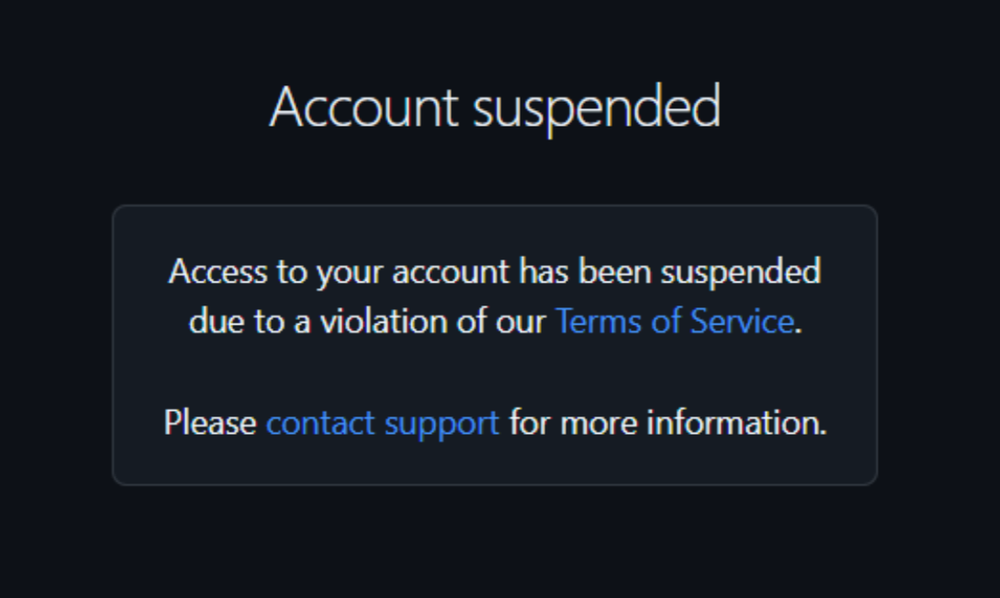

## github 계정이 정지됨

> 2026-04-15

새로운 프로젝트를 기획하고, 빠르게 개발하기 위해서 레포지토리를 새로 만들었다.

모든 문서를 markdown으로 정리해놓았으며, 해당 문서들을 깃허브로 관리하고자 organization을 하나 만들고 `docs` 라는 이름으로 repository를 하나 생성했다.

문서를 깔끔하게 정리하다보니 organization을 꾸미고 싶다는 욕심이 생겨서 `.github` repository를 생성하여 `profile/README.md` 파일을 하나 작성했다.

여기까지는 흔한 프로젝트 세팅 과정이었는데, 도중에 문제가 발생했다.

웹에서 간단하게 편집한 내용을 커밋하기 위해 버튼을 누르자마자 재로그인이 요구되었다. 로그인을 다시 하자 계정이 정지되었다는 안내를 받았다. 

단순 로그인이 불가능해진 것이 아니라 프로필에 접근조차 불가능해졌다. 기존 아이디로 접근을 시도하자 403 에러가 발생하였으며, 브라우저에서는 404 페이지를 받아볼 수 있었다. (...)

다행히 로컬에 코드가 남아있긴 하였으나, 깃허브를 사용할 수 없다는 건 큰 지장을 주었다. 기존에 진행하던 프로젝트를 이어서 하기 어려워졌으며, 가장 큰 문제는 내 레포지토리에 접근할 수 없다는 것이었다. 

깃허브 계정 복구를 위해 일단 깃허브에 문의를 넣긴 하였으나, 하루가 지나도록 연락이 오지 않았다. 

몇 달이나 지난 뒤에야 복구가 되었다는 이야기도 있어서 당분간은 새로운 계정으로 프로젝트를 진행해야 할 것 같다. 제발 빠른 시일 내에 복구되길 바란다...

이번 사건으로 내가 깃허브라는 하나의 서비스에 얼마나 의존적이었는지 알 수 있었다. 앞으로는 gitlab 등 다른 저장소에도 함께 백업해두는 과정도 필요하다고 느꼈다. 또 중요한 자료는 로컬에도 백업해두어야 할 필요성을 느꼈다.